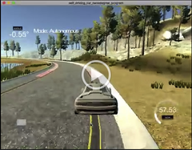

# CarND-Controls-PID
Self-Driving Car Engineer Nanodegree Program

The goal of this project is to implement a PID controller that is capable of steering the simulated car on the road in the Term 2 simulator, and to tune the parameters of the controller so the car can safely drive around the course. 

The controller software receives an error value from the simulator, which shows how far off is the car from the center line of the car. The PID controller has to use this error value to generate a steering angle input to the simulator.

[//]: # "Image References"

[image1]: ./writeup_images/rawgraphs.png "Analyzing the error data in RAWgraphs"

## Solution approach

### PID controller implementation

I first set out to implement a basic PID control loop in the PID.cpp file. But there were two unusual factors when designing this control loop. One is that the simulator sends updates at a slightly irregular rate. To account for the irregularity I decided to use the time since the last event as the time base when calculating the proportional an integral errors (multiplying the current error with dt to get the integral error increment, and dividing by dt to get the current derivative).

The other challenge is caused by the fact that the vehicle's speed is variable. I decided to compensate for this fact by taking the distance travelled multiplied by the distance from the centerline as the proportional error, instead of just the distance from the centerline. I considered this to be a more speed-independent measure of the error. 

### Hand tuning of gains

Once my PID control loop was in place, I tried to identify some approximate Kp, Ki and Kd controller terms using the Ziegler–Nichols method. I set the integral and derivative gains to zero and increased the proportional term until the car went into a more-or-less stable oscillation. The fact that the road is curved made this process quite inexact, as the turn caused a disturbance in the controller. Once I determined a reasonable estimate for this ultimate gain, I used Pessen's Integral Rule to get initial Ki and Kd terms.

I used RAWgraphs to quickly visualize the data:

![RAWgraphs][image1]

 I ran the simulation with these values, but the car did not manage to stay on the road. The limited steering angle of the car caused a significant integral error at the tight turns, which caused the car to keep turning even after the turn was complete. This was a classic case of Integral windup. I decided to try to address this issue by reducing the integral gain. I considered putting in a mechanism to zero out the integral error when the car crossed the center line, but it didn't turn out to be necessary.

I also tweaked the proportional and derivative terms until the car was able to circumnavigate the track safely.

I used the following rules of thumb to tweak the parameters:

- If the car went into a rapid oscillation, it meant that the derivative term may be too low or the proportional term too high
- If the car fell off the road on the outside of a turn, it meant that the proportional term was too low
- If the car fell off the road on the inside of the turn, it meant that the integral term was too large
- If the car was following the general direction but kept going into a long oscillation, it meant that the integral term was too low or too high

Some examples of these faults:

Integral oscillations:

 

P too small:

P too big:

In order to control the vehicle's speed I also added a secondary PID controller to output throttle values based on a set target speed. I quickly hand-tuned it with some plausible parameters that keep the speed around the target speed and don't cause unnecessarily hard breaking or acceleration.

### Fine-tuning of gains

The hand-tuning resulted in an acceptable setup, but I wanted to see how fast I can get the car around the track. For this, hand tuning was too slow and labor intensive, so I investigated automated approaches. 

#### Genetic Algorithms

There is a significant body of publications that recommends using genetic algorithms to determine ideal gain values.

The basic concept is very similar to the Particle Filter algorithm: the genetic algorithm generates, let's say 50 sets of random gains and measures the system error with each of these gains. Then the algorithm randomly selects 10 sets of gains from the initial list, with the selection probability based on the system error (the lower the error the more probable an item is to be selected).  Then it selects 10 pairs of "parents" from the list, and generates 40 new items by combining the values of the parent values (taking one of Kd, Ki, Kp from one parent, and the other two from the other, or taking the mean of the Kd, Ki, Kp parameters of the parents). Some mutations (random parameter changes) are also introduced in this parenting process. Then the experiment is re-run with the new list of the 10 individuals from the old list and the 40 children, and the process continues until a desired low error is reached.

Unfortunately for this algorithm to work, it has to be possible to run a large amount of experiments with random gain values. The way the simulator is set up, most of the gain combinations cause the car to fall of the road, at which point the simulator no longer moves the car. There is no easy way to control or restart the simulator from the controller application (other than restarting the process and using window messages to restart it, which I decided was against the spirit of the exercise). Also, the simulation only runs at real time, which means that each experiment takes around a minute, so one generation of the Genetic Algorithm would run for up to an hour.

Due to the experiment-unfriendliness of the simulator I gave up on running a Genetic Algorithm to fine-tune the parameters, and decided to use a Twiddle approach instead.

#### Twiddle

I implemented a Twiddle framework in the `twiddle.cpp` file. This framework takes a set of initial gains, a set of initial delta values, an initial error and goal error. The code takes the initial gains and adds the delta value to one of the gains and sets up the PID controller with these new gains. Then it observes the system error (calculated by the mean squared error) and if it is improved to the previous state, it keeps the new parameters and increases the corresponding delta value. If the error increases, the twiddler tries to subtract the delta from the gain in question and tests again. If this also fails to improve the error, the parameter is returned to its original state and the delta is reduced. Then the twiddler moves on to the next parameter, and repeats this process until a desirable goal error is reached.

In order to minimize human supervision, I set up the twiddler to approximate when the car completes a full lap (calculating the travelled distance from speed and time) and start a new step each lap. If the car falls of the road, the simulator has to be manually restarted, but the twiddler detects this scenario as well and considers that run a failed experiment.

I discovered that the result of Twiddling is highly dependent on the initial hyper-parameters: the initial gains and delta values. So I tried a set of essentially random hyperparameters to get a feel for the results they produce. 

Out of all the experiments I got the best results from twiddling my initial Ziegler-Nichols parameters, which resulted in Kp=0.331, Ki=0.2419 and Kd=0.798. Other, similarly good (in terms of MSE) solutions were quite far away in the parameter space, for example Kp=0.1, Ki=1.65 and Kd=7.49. This confirmed my feeling that a random, wide search of the parameter space would produce better values than fine-tuning one of the small areas that we discovered by accident.

### Speed control

Finally I tried to see how fast the car can negotiate the course. I quickly discovered that there are some sharp turns that the car just cannot negotiate if the speed is too high, even with the best possible control. So I added a simple mechanism that check the steering output of the steering PID controller and feeds a lower target speed to the speed PID controller as the steering angle approaches. 

I also tried using the error value or the accumulated integral error from the steering controller to determine  the speed, but I got the best results by using the steering angle.

With this simple tweak, I managed to reach top speeds of around 60mph and go around the track in around 55 seconds (corresponding to an average speed of 78 km/h). With smarter speed control I'm sure this could be improved.

### Shortcomings

-----

The fundamental challenge of controlling the car with the PID controller this way is that the error fed into the controller is a past error, and does not take the upcoming trajectory into account. This not only causes a time delay between when the car starts drifting off the centerline and when the PID controller can react, but also makes speed control very difficult, as breaking when the car is already in a sharp turn is just too late, and in fact in the real world would exacerbate the already bad situation.

So a better approach would be to do what everyone is taught at driving school and look at the path ahead when deciding throttle and steering values.

## Build and execution

For build and execution instructions, see [README_orig.md](README_orig.md)

---

